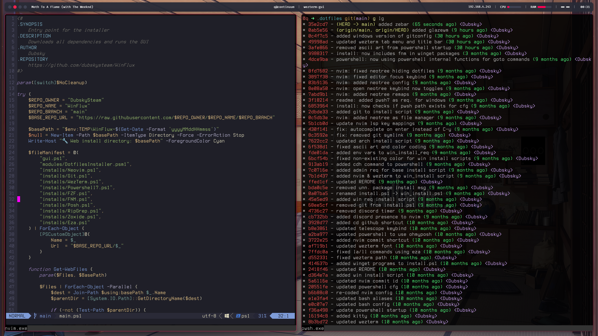

<div align="center" style="display: flex; align-items: center; gap: 10px;">
    
    <h1 style="margin: 0;">WinFlux</h1>
</div>


### Reference screenshots and videos at the bottom

## Installation
WEB INSTALL (**fastest**):
```powershell
irm https://raw.githubusercontent.com/DubskySteam/WinFlux/main/main.ps1 | iex
```

LOCAL INSTALL:
```
git clone https://github.com/DubskySteam/WinFlux.git
cd WinFlux
.\main.ps1
```

## Included dotfiles & enhancements
[Applications]
```
- Git
- Neovim
- VSCode
- Zen Browser
- Glaze Window Manager
- Zebar
```
[Tweaks]
```
- Performance mode
- Disables Telemetry
```

## Project Structure
```
/WinFlux
├── main.ps1       # Entry point
├── gui.ps1        # User interface
├── installs/      # Installation & setup scripts
└── tweaks/        # System tweaks of all sorts
```
## Reference

